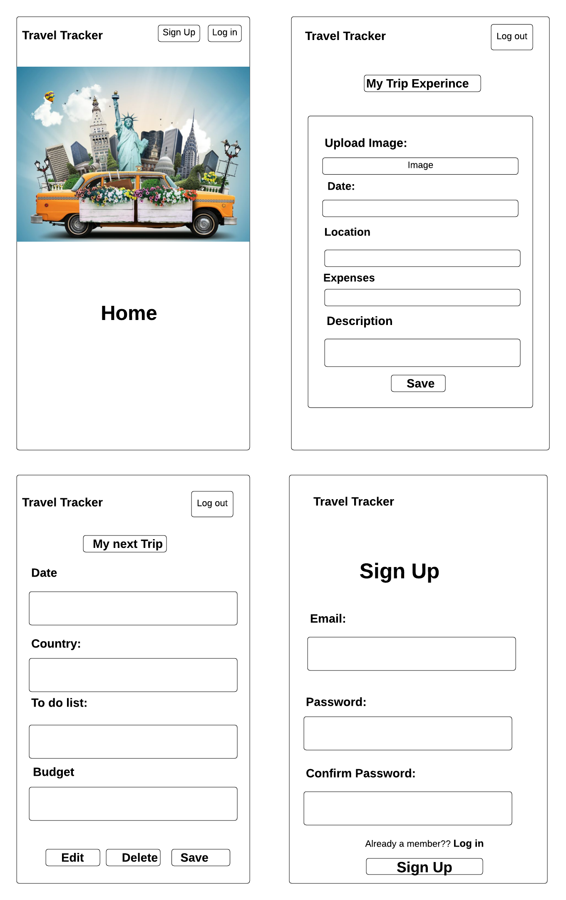
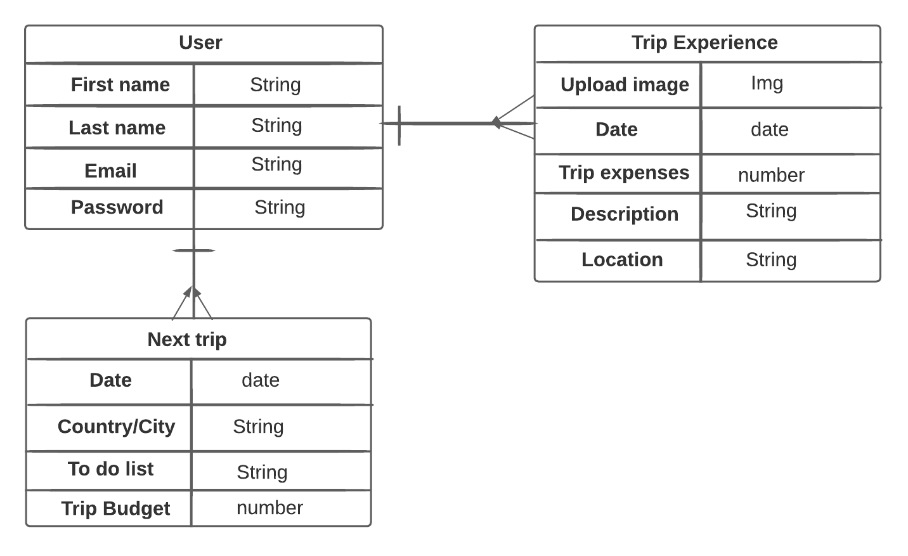

# Travel Tracker App

This website will allow its visitors to make a record of their trip they made around the world and be able to plan trips they would like to make in the future. This app will allow users to make a descision if they would like to publish as many trip experiences they had or just keep it private. 

## User Stories

1. As an unregistered user, I would like to sign up with an email and password.
2. As a registered user, I would like to sign in with an email and password.
3. As a signed in user, I would like to change my password.
4. As a signed in user, I would like to sign out.
5. As an unregistered user, I would like to be able to sign up.
6. As an unregistered user, I would like to read about the idea of the website
7. As a signed in user, I would like to create a note of my trip experiences.
8. As a signed in user, I would like to eidt my trips.
9. As a signed in user, I would like to delete my trips.
10. As a signed in user, I would like to create my trip palns.
11. As a signed in user, I would like to Edit my trip palns.
12. As a signed in user, I would like to delete my trip palns.
13. As a signed in user, I would like to choose which trips and plans I want to shared or   kept private.

## WireFrames

Index Page

## ERD

## Technologies Used

1. HTML5
2. CSS
3. Python
4. Django
5. AWS

